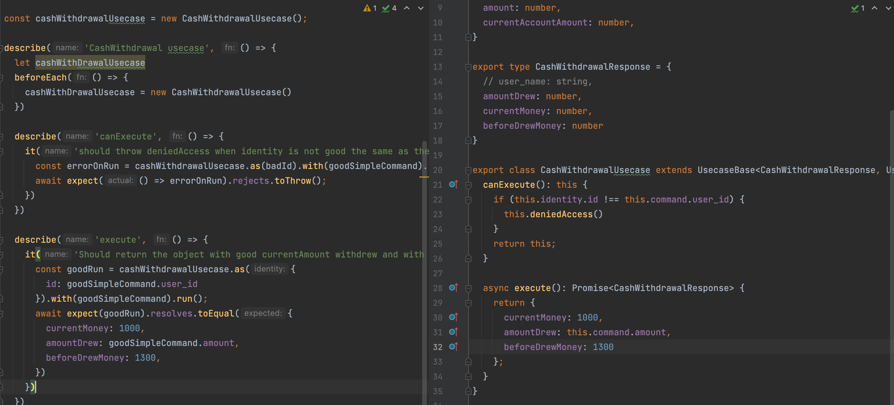
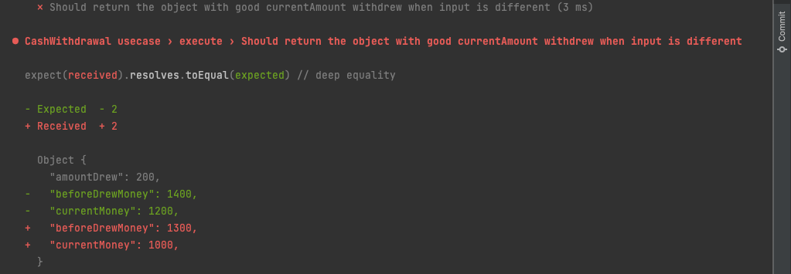
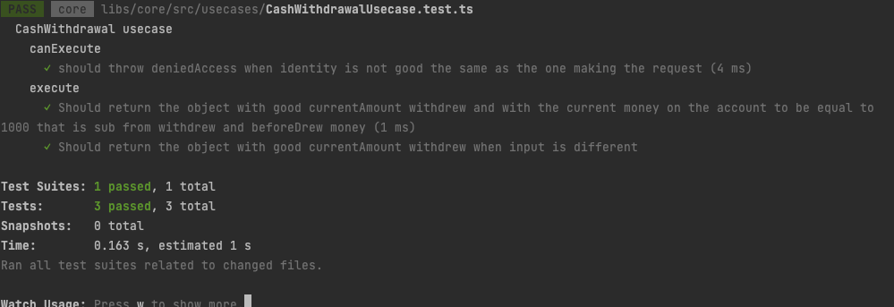

# Testing process usecase



As TDD is a way to design the code, i needed the simplest babystep to do what i wanted but there is an issue, the code is not generic.
Thus, i needed to create another test to validate my code, if he goes red, then i should write code, if not the behaviour is good.

```ts
it('Should return the object with good currentAmount withdrew when input is different', async () => {
      const goodRun = cashWithdrawalUsecase.as({
        id: goodDifferentCommand.user_id
      }).with(goodDifferentCommand).run();
      await expect(goodRun).resolves.toEqual({
        currentMoney: 1200,
        amountDrew: goodDifferentCommand.amount,
        beforeDrewMoney: 1400,
      })
    })
```

```ts
const goodDifferentCommand: UserCommand = {
  user_id: 'good_id',
  amount: 200,
  currentAccountAmount: 1400,
}
```


Of course, it went red.

To make the test pass I needed to implement another logic:
```ts
  async execute(): Promise<CashWithdrawalResponse> {
    const currentMoney = this.command.currentAccountAmount - this.command.amount
    return {
      currentMoney: currentMoney,
      amountDrew: this.command.amount,
      beforeDrewMoney: this.command.currentAccountAmount
    };
  }
```
Everything pass and my previous code still works


Time to refactor:

```ts
async execute(): Promise<CashWithdrawalResponse> {
    const currentMoney = this.command.currentAccountAmount - this.command.amount;
    return {
      currentMoney,
      amountDrew: this.command.amount,
      beforeDrewMoney: this.command.currentAccountAmount
    };
  }
```

And my test still pass !


Nice !


